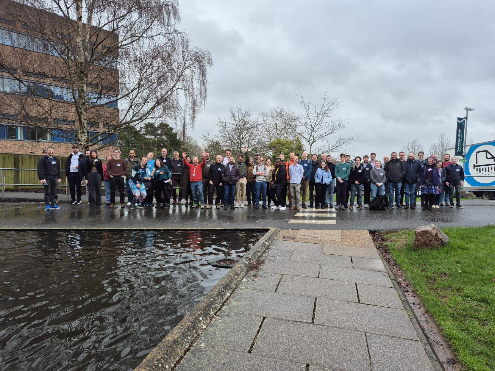

The third RSE South West meeting took place at the University of Exeter,
bringing together 52 participants from across the region. 
The programme featured two keynote talks and 12 short talks (5–10 minutes)
organised around three themes: “Community and Recognition in RSE”,
“Methods, Practices, and Tools" in Research Software, and
“Beyond Academia”. The event was funded by the Research Software Engineers
Society through their Events & Initiatives Grant, and we would like to
extend a big thank you for their support.  

{fig-alt="A large group of approximately  people standing outside the Peter Chalk Centre at the University of Exeter" fig-align="center"}

## Keynote Talks 

We kicked off promptly at 10am with our first keynote speaker,
Emma Hogan from the Met Office. Her interactive talk kept the 
audience engaged while also gathering live insights into people’s 
views on Scrum and collaboration with research teams. 

The second keynote was delivered by Tom Green and Ana Price from
Bristol Centre for Supercomputing (BriCS), home to the Isambard-AI
and Isambard 3 systems. Their talk explored how modern HPC centres
are reshaping roles to bridge systems administration and research
software engineering, enabling researchers to work more effectively with increasingly complex software environments.  

## Community and Recognition in RSE 

We then moved into our first session of short talks, themed
“Community and Recognition in RSE”. The session highlighted the
many ways RSEs build and sustain communities across institutions
and disciplines. A presentation on JOSS from Warrick Ball emphasised
opportunities for RSEs to take the lead on research software publications
and gain recognition for their contributions. 

Speakers also introduced several teams and initiatives that support
researchers and strengthen the RSE community. We heard about the RSE
group at the University of Bath from Stephen Cook, the NERC Earth
Observation Data Analysis and AI Service at Plymouth Marine Laboratory
from Dan Clewley, and climate services work at the Met Office from Daniel
Cubbon.  

Michael Pei highlighted the RSE-supported server infrastructure
at the Bristol Composites Institute. Nicole Whippey gave an update
on the X-Cited and GW4 initiatives from the University of Exeter,
both of which aim to foster collaboration and connections across
institutions: https://gw4.ac.uk/x-cited/.  

 
## Lunch and Walk 

We had a buffet lunch in the foyer and common area, which made for great
socialising and networking with both new and familiar colleagues.
Fortunately, the weather held out, and we were able to get some fresh
air with a short walk around the Reed Hall gardens, which were showing
the first signs of spring with banks of early spring flowers. 

 
## Methods, Practices, and Tools in Research Software 

Session 2 featured four fantastic lighting talks focused on “Methods,
Practices, and Tools” in Research Software in an action packed 30 minutes! 

James Frost (Met Office) opened with a showcase on automatically testing
web interfaces with Playwright, highlighting the growing need for
reliable, automated UI validation in RSE projects.  

Kieren Pitts (University of Bristol) then demonstrated a Telegram bot that
delivers seasonal climate forecasts directly to users, illustrating how
messaging platforms can simplify the process.  

Tom Bending (University of Exeter) discussed efforts to accelerate
astrophysical simulations on GPUs, focussing on the challenges of adapting
decades‑old CPU‑optimised code and showing some fascinating videos of
star cluster formation.  

Finally, Fred Wobus (University of Exeter) explored whether an MCP server
could serve as a flexible alternative to traditional command‑line clients,
which was motivated by a project with Defra.  

## Beyond Academia 

The afternoon saw a session focussing on research software engineering
outside of academia.  

Jack Feltham from Syngenta spoke about working as a bioinformatician
in the life sciences industry. He compared industry and academia,
noting that academia often focuses on deep, exploratory work in small
groups, while industry work typically involves multiple projects with a
stronger emphasis on collaboration.  

Jacob Tomlinson from NVIDIA then introduced GPU-accelerated data science
with the RAPIDS libraries from the CUDA-X ecosystem. He highlighted how
RAPIDS allows Python developers to use GPUs alongside familiar tools such
as Pandas and Scikit-Learn without writing CUDA kernels.  

Throughout the event, both speakers emphasised that industry is not one
monolithic entity and that there is a lot of variety in the work being
done, encouraging us to bear this in mind when talking about how things
are done in industry vs academia.  

## The Panel Discussion: Quality and Reproducibility in Academia and Industry 

The day concluded with a panel discussion on “Quality and Reproducibility
in Academia and Industry”, featuring Emma Hogan (Met Office),
Jacob Tomlinson (NVIDIA), Jack Feltham (Syngenta), and Dan Clewley (Plymouth Marine Laboratory), chaired by Kolen Cheung (University of Exeter).  

A clear consensus emerged: both academia and industry value quality
and reproducibility, but the real challenge lies in balancing practices
such as testing, documentation, and reproducibility with delivering
results under time pressure. As Emma noted, drawing on Agile principles,
the level of investment should ultimately be guided by stakeholder value.
Ultimately reproducibility is a matter of degree, and that choosing the
appropriate level for a given project is a skill every RSE must develop. 

The discussion ended on a thought-provoking note when Jacob observed that
much of industry’s open-source work, including GPU-accelerated software at
NVIDIA, is developed in the open and subject to public scrutiny, whereas
much academic work still happens behind closed doors.  

## Pub Trip! 

Overall, it was a vibrant day, with the talks giving participants plenty
to discuss as conversations continued into the pub at The Imperial,
conveniently located on the way to Exeter St Davids station.  
