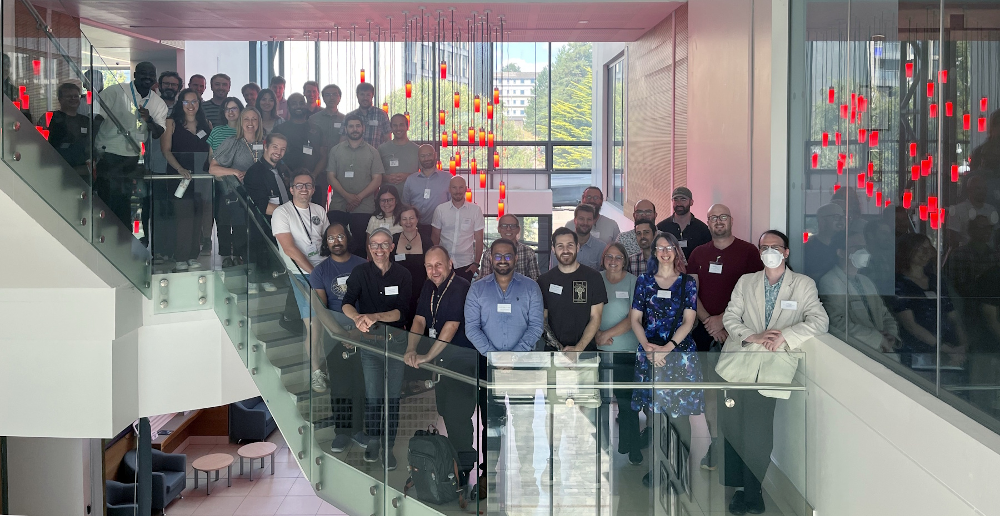

*This report was authored by Stephen Cook.*

The fourth RSE South West regional group meeting took place on 31st July 2026.
A total of 54 RSEs and people with related job-roles attended the in-person event at the University of Bath, hosted by its RSE Facility.
The event was funded by the [Society of Research Software Engineering](https://society-rse.org/) [Events and Initiatives Grant](https://society-rse.org/policy-for-socrse-events-and-initiatives-grant/).

{fig-alt="Attendees of the fourth RSE South West regional meeting pose on a staircase in the 10W building in the University of Bath." fig-align="center"}

The day involved one keynote talk, 17 talks and one discussion session.
Attendees came from Universities (Bath, Bristol, Exeter, UWE and Swansea) as well as industry including the Met Office, Plymouth Marine Laboratory and DAFNI.

## Talks

Following introductions from the host facility and one of the group organisers, Ed Bennett of Swansea University gave the keynote talk on the [SHAREing network](https://shareing-dri.github.io/).
Swansea had not previously been represented in the regional group meetings, and his engaging talk was well received and followed by questions from the room.

The other morning talks were broadly along a "group introduction" theme, with presentations from Bath's [Institute for Mathematical Innovation](https://imibath.ac.uk/), Bristol's upcoming Mathematics Innovation Initiative, a [space weather group](https://weather.metoffice.gov.uk/specialist-forecasts/space-weather) at the Met Office, then ending with two talks from [DAFNI](https://www.sc.stfc.ac.uk/programmes/dafni/).
The two mathematical innovation groups represent models with different concerns to typical RSE teams but similar models.

The afternoon was split into two presentation sessions broadly themed around projects and HPC.
We heard from an SSI fellow from Cardiff University, four talks from University of Bristol, three from University of Bath, two from the Met Office and one from Red Oak Consulting (who've been working with Bath).
We closed out the day with a Padlet discussion session on use of GenAI for coding.

## Breaks and Social

Between sessions, attendees networked over hot drinks.
Lunch was provided as a choose-your-own packed lunch which was taken outside to enjoy the weather.

Following the event discussions continued over drinks and pizza at The Bell Inn in Bath.

## Feedback

Early feedback is generally positive and suggests a desire for more empasis on networking and discussion time at future events.

## Acknowledgement

We're grateful to the [Society of Research Software Engineering](https://society-rse.org/) for providing financial support for this meeting.

 for terms of use.](https://society-rse.org/wp-content/uploads/2022/05/Soc_RSE_master_logo4-766x1024.png){width=10% fig-align="left" fig-alt="The Society for Research Software Engineering logo in colour."}
